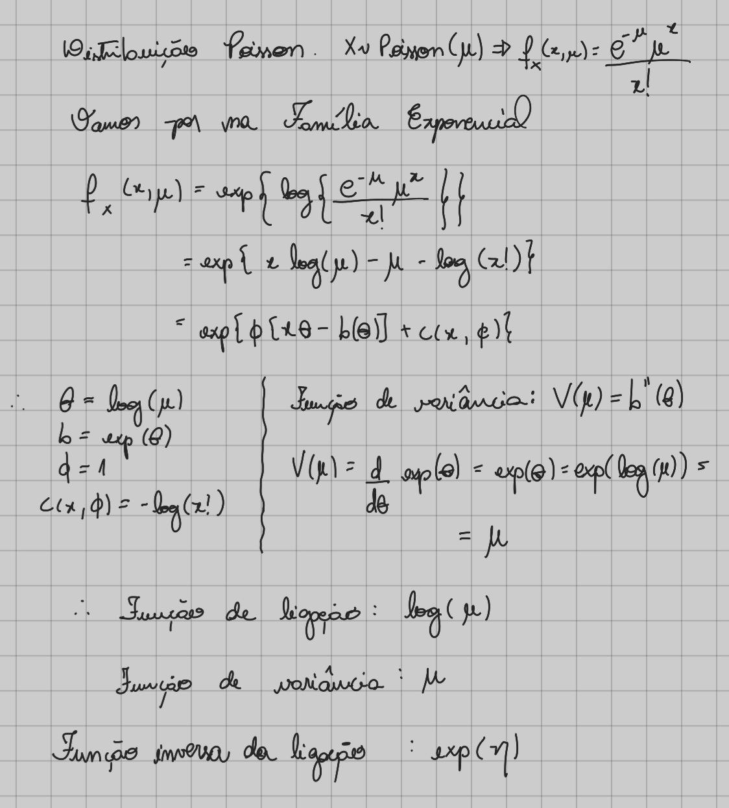
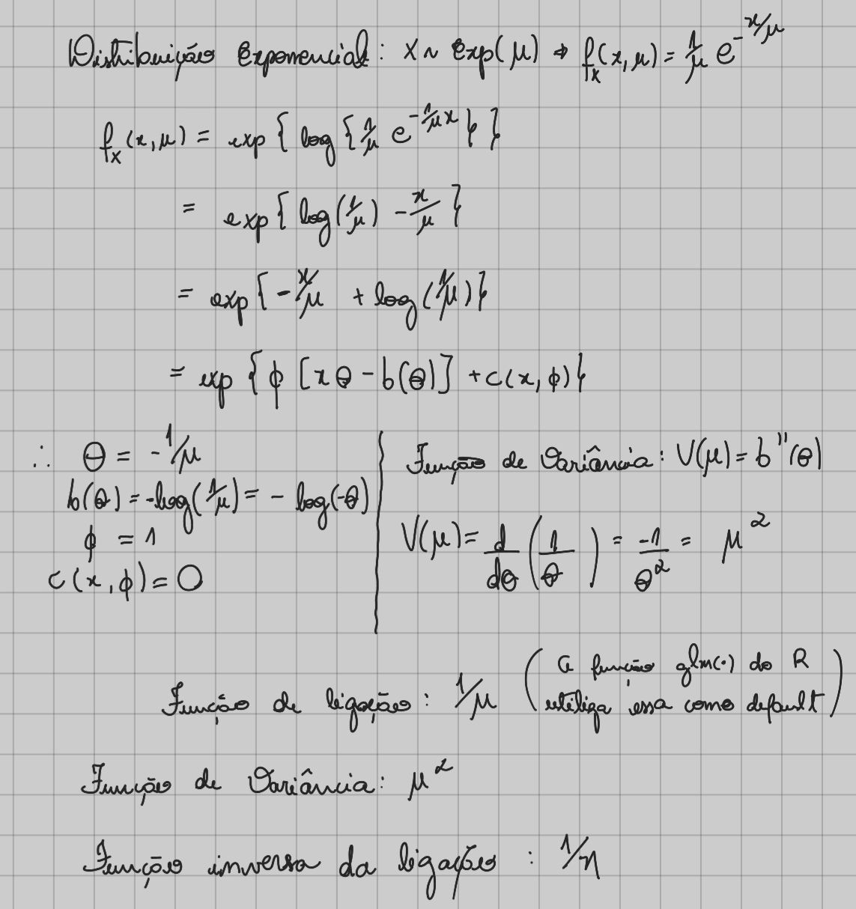

```{r setup, include=FALSE}
knitr::opts_chunk$set(echo = TRUE)
```

Bibliotecas que vamos utilizar nos exercícios:

```{r}
library(datarium)
library(faraway)
```

Remover notação científica.

```{r}
options(scipen = 999)
```

Vamos à resolução dos exercicios propostos

# 1) Implemente o algoritmo de estimação considerando duas situações:
## a) Caso continuo (não use a distribuição normal)
## b) Caso discreto
## c) Para ambos os casos apresente um relatório detalhando todos os passos dos programas.

Para resolver os itens acima, vamos construir uma função que recebe os seguintes argumentos:

* like_func: função de ligação do modelo;
* y_vetor: vetor de dados referente a resposta;
* variance_function: função de variância;
* matrixX: matriz do modelo X;
* inv_like_func: função inversa da ligação;
* max_iter: número máximo de interações;
* tolerance: tolerância adotada.

Assim, temos uma função que abrange tanto o caso contínuo e o caso discreto. Satisfazendo, assim, os itens *a* e *b*.

Para solucionar o item *c* faremos comentários detalhando a função implementada. 

```{r}
#' Método interativo
#' 
#' @description
#' Método de estimação interativo numérico para modelos lineares generalizados.
#' 
#' @section Maintainers:
#' nan-oliveira
#'
#' @author nan-oliveira
#' 
#' @param like_func - deve receber um valor do tipo expression.
#' A função de ligação em razão de mu.
#' 
#' @param y_vetor - vetor com os dados Y.
#' 
#' @param variance_function - deve receber um valor do tipo expression.
#' Função de variância.
#' 
#' @param matrixX - matriz do modelo X.
#' 
#' @param inv_like_func - deve receber um valor do tipo expression.
#' Função inversa da ligação em função de eta.
#' 
#' @param max_iter - valor numérico. Número de máximo de interações.
#' 
#' @param tolerance - valor numérico. Referente a tolerância adotada.
#' 
#' @return Vetor com os betas estimados.
#' 
metodoInterativo__ <- function(
    like_func,
    y_vetor,
    variance_function,
    matrixX,
    inv_like_func,
    max_iter,
    tolerance
) {
  dlike_func <- D(like_func, "mu") # derivada da função de ligação
  # Passo 1
  
  # valor inicial para mu. Tomamos o valor de y. Se o valor de y for igual a 0
  # somamos o valor 1 para evitar inconsistências nos cálculos.
  mu <- ifelse(y_vetor == 0, y_vetor + 1, y_vetor)
  # Valor de eta é igual a função de ligação avaliada em mu
  eta_i <- eval(like_func)
  # Valores de w como a inversa da multiplicação entre a função de variância 
  # avaliada em mu e o quadrado da derivada da função de ligação avaliada em mu
  w_i <- 1 / (eval(variance_function) * (eval(dlike_func) ^ 2))
  # A matriz W é a matriz diagonal com na diagonal os valores de w.
  W_mat <- diag(w_i)
  # No passo 1 o valor de Z_i é igual a eta, porque y_vetor é igual a mu (desde que y_vetor != 0)
  z_i <- eta_i
  
  # No Passo 1 os betas estimados são tomados como -Inf para que não gere erro
  # na hora de realizar a primeira comparação dentro do for.
  beta_est <- matrix(-Inf, nrow = ncol(matrixX))
  
  # Demais passos
  for (i in seq(2, max_iter)) {
    # Guardo o beta do passo anterior
    beta_est_old <- beta_est
    # Multiplicação de matrizes: X'W
    xTw <- t(matrixX) %*% W_mat
    # Beta estimado: (X'WX)^-1 X'W z
    beta_est <- solve(xTw %*% matrixX) %*% xTw %*% z_i
    
    # Atualização dos valores 
    
    # Matriz X vezes beta: Xb
    eta <- as.vector(matrixX %*% beta_est)
    # Mu: função inversa da ligação avaliada no novo valor de eta
    mu <- eval(inv_like_func)
    # devirada da função de ligação avaliada no novo valor de mu
    dlkF <- eval(dlike_func)
    # Valores de w como a inversa da multiplicação entre a função de variância 
    # avaliada em mu e o quadrado da derivada da função de ligação avaliada em mu
    w_i <- 1 / (eval(variance_function) * (dlkF ^ 2))
    # A matriz W é a matriz diagonal com na diagonal os valores de w.
    W_mat <- diag(w_i)
    
    # A matrix G é uma matrix diagonal sendo na diagonal os valores da
    # devirada da função de ligação avaliada no novo valor de mu
    G <- diag(dlkF)
    # Atualização do vetor z
    z_i <- eta + G %*% (y_vetor - mu)
    
    # Cálculo do critério de parada
    stop_crit <- sum(abs((beta_est - beta_est_old) / beta_est_old))
    # verificação de parada
    if (!is.nan(stop_crit) & (stop_crit <= tolerance)) {
      break
    }
  }
  beta_est <- beta_est[ , 1]
  return(beta_est)
}
```


## 2) a) Execute seus códigos considerando dois conjuntos de dados (um para cada distribuição)
## b) Compare os resultados obtidos na sua implementação com a função glm do R (ou similar em outras linguagens).

Para avaliar o método que implementamos, vamos utilizar as distribuições Poisson e Exponencial. Para saber quais são as funções de ligação, função de variância e a função inversa da ligação. Vamos escrever as duas distribuições na família exponencial.

* Distribuição Poisson

# 

* Distribuição Exponencial

# 

Sendo assim, vamos à execução dos códigos para dados com distribuição Poisson. Para tal, utilizaremos os dados `gala` presente no pacote `faraway`. Para saber mais acesse: <https://en.wikipedia.org/wiki/Gal%C3%A1pagos_Islands>.

Esses dados são referentes a 30 ilhas Galápagos contendo 7 variáveis. A relação entre o número de espécies vegetais e diversas variáveis geográficas é o interesse.

* Species: o número de espécies de plantas encontradas na ilha;
* Endemics: o número de espécies endêmicas;
* Area: área da ilha (em km^2);
* Elevation: a maior elevação da ilha (em m);
* Nearest: a distância da ilha mais próxima (em km);
* Scruz: a distância da ilha de Santa Cruz (em km);
* Adjacent: a área da ilha adjacente (em km^2).

Ajuste do modelo:

```{r}
matrixX <- cbind(1, gala[, -1])
names(matrixX)[1] <- "(Intercept)"
matrixX <- as.matrix.data.frame(matrixX)
coefPoiss <- metodoInterativo__(
    like_func = expression(log(mu)),
    y_vetor = gala[["Species"]],
    variance_function = expression(mu),
    matrixX = matrixX,
    inv_like_func = expression(exp(eta)),
    max_iter = 1000,
    tolerance = 10e-09
)
round(coefPoiss, 6)
```

Agora, vamos ajustar o modelo para a distribuição exponencial. Para tal, utilizaremos os dados `marketing` presente no pacote `datarium`.
Esses dados são referentes ao impacto de três advertising medias (youtube, facebook e newspaper) nas `sales`. Os dados são o orçamento de publicidade em milhares de dólares junto com as vendas.

* youtube: orçamento de publicidade em milhares de dólares pelo youtube;
* facebook: orçamento de publicidade em milhares de dólares pelo facebook;
* newspaper: orçamento de publicidade em milhares de dólares pelo newspaper;
* sales: vendas em milhares de dólares.

Ajuste do modelo:

```{r}
matrixX <- cbind(1, marketing[, -ncol(marketing)])
names(matrixX)[1] <- "(Intercept)"
matrixX <- as.matrix.data.frame(matrixX)
coefExp <- metodoInterativo__(
    like_func = expression(1/mu),
    y_vetor = marketing[["sales"]],
    variance_function = expression(mu^2),
    matrixX = matrixX,
    inv_like_func = expression(1/eta),
    max_iter = 1000,
    tolerance = 10e-09
)
round(coefExp, 6)
```

Por fim, vamos comparar o resultado da função que implementamos com o resultado da função glm do R.

* Distribuição Poisson 

```{r}
modelPoiss <- glm(formula = Species ~ ., data = gala, family = poisson(link = "log"))
modelPoiss$coefficients
```

* Distribuição Exponencial

```{r}
modelExp <- glm(sales ~ ., data = marketing, family = Gamma(link = "inverse"))
summExp <- summary(modelExp, dispersion = 1)
summExp
```

```{r}
summExp$coefficients[, 1]
```


* Tabela de comparação para a distribuição Poisson

```{r}
resultadoPoiss <- data.frame(
  resulManual = round(coefPoiss, 6),
  resulGlm = round(modelPoiss$coefficients, 6)
)
names(resultadoPoiss) <- c("Resultado via implementação",
                           "Resultado via função glm")
resultadoPoiss
```

Pela tabela acima, podemos notar que obtivemos as mesmas estimativas.

* Tabela de comparação para a distribuição exponencial

```{r}
resultadoExp <- data.frame(
  resulManual = round(coefExp, 6),
  resulGlm = round(summExp$coefficients[, 1], 6)
)
names(resultadoExp) <- c("Resultado via implementação",
                         "Resultado via função glm")
resultadoExp
```

Pela tabela acima, podemos notar que obtivemos as mesmas estimativas.
